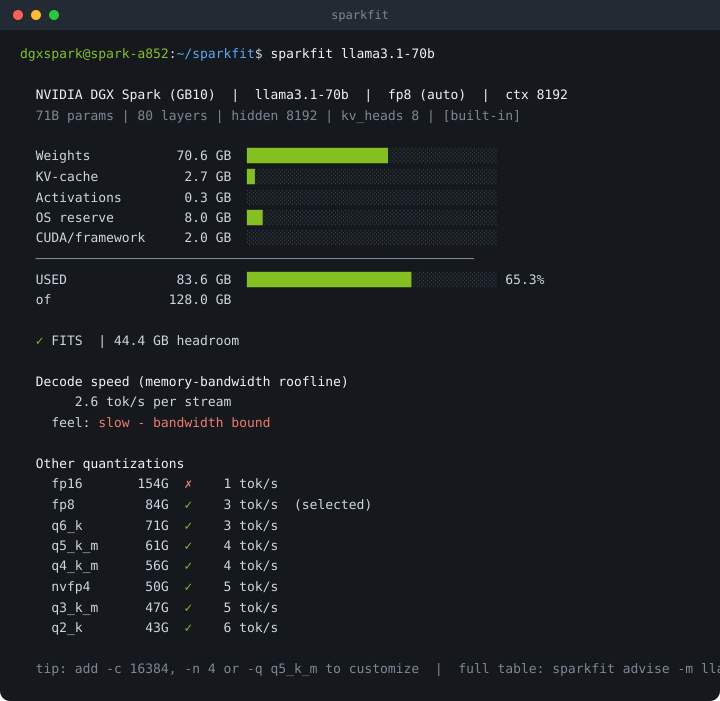

<p align="center">
  <picture>
    <source media="(prefers-color-scheme: dark)" srcset="assets/logo-dark.svg">
    
  </picture>
</p>

<p align="center">
  <a href="https://github.com/engineering87/sparkfit/actions/workflows/ci.yml"></a>
  <a href="LICENSE"></a>
  
  <a href="https://github.com/astral-sh/ruff"></a>
  
</p>

**LLM memory capacity planner for the NVIDIA DGX Spark (GB10).**

Catalog tools answer "does this model fit on my hardware, yes or no?" on generic
GPUs. sparkfit treats the DGX Spark as what it is: a 128 GB unified-memory machine
that is, above all, memory-bandwidth bound (273 GB/s shared between CPU and GPU).
So it answers three questions a fit/no-fit catalog does not:

1. Unified-memory budgeting. How the 128 GB is really split between weights,
   KV-cache, activations, the CUDA/serving framework, and the slice you must leave
   for the Grace CPU side and the OS.
2. Will it actually be fast? A memory-bandwidth roofline estimate of decode
   throughput (tokens/s). On Spark, "it fits" and "it is usable" are two different
   things, and bandwidth, not capacity, is the limit.
3. How to make it fit or scale. A quantization advisor (the highest-quality format
   that fits with a safety margin) and a concurrency planner (how many parallel
   streams or model replicas fit at once).

Pure Python standard library. No dependencies.

## Install

sparkfit is a CLI, so [pipx](https://pipx.pypa.io/) is the cleanest way to install
it (isolated environment, global `sparkfit` command):

```bash
pipx install git+https://github.com/engineering87/sparkfit.git
```

On a fresh DGX Spark (DGX OS) you may need pipx first. Note that a plain
system-wide `pip install` is blocked by PEP 668 on these systems:

```bash
sudo apt install -y pipx && pipx ensurepath   # then restart the shell
```

Plain pip works inside a virtual environment:

```bash
python3 -m venv .venv && . .venv/bin/activate
pip install git+https://github.com/engineering87/sparkfit.git
```

Or clone and run the single file, no install needed (handy for pasting onto a
fresh DGX Spark):

```bash
git clone https://github.com/engineering87/sparkfit.git
cd sparkfit
python src/sparkfit.py llama3.1-70b  # or: ./sparkfit llama3.1-70b
```

## Quick start

Pass just a model name and sparkfit does the rest: it auto-selects the
highest-quality quantization that fits with margin, a typical context (8192), and
shows the budget, the verdict, estimated tok/s, and the alternatives.

```bash
sparkfit llama3.1-70b          # built-in catalog id
sparkfit "llama 70"            # partial match -> llama3.1-70b
sparkfit 72b                   # even a fragment works
sparkfit Qwen/Qwen2.5-7B       # Hugging Face id -> reads params online
sparkfit /models/my-model/config.json   # a local config.json (file or dir)
```

<p align="center">
  
</p>

Override any default: `sparkfit qwen2.5-72b -c 16384 -n 4 -q q5_k_m`.

### `--live`: plan against the memory free right now

Run on the Spark, `--live` budgets against currently-free memory (read from
`/proc/meminfo` and `nvidia-smi`) instead of the theoretical 128 GB, and waives
the OS reserve, since the free figure already excludes the OS and running
processes. Useful when you already have models or containers loaded and want to
know what you can still add.

```bash
sparkfit llama3.1-8b --live
sparkfit qwen2.5-32b --live
```

## Commands

| Command | What it does |
|---|---|
| *(none)* | Pass just a model and get a one-shot smart report with sensible defaults |
| `plan`   | Full unified-memory budget plus a decode-speed roofline for one configuration |
| `advise` | Recommends the highest-quality quant that fits with a 10% margin |
| `fit`    | Scans the model DB for what fits; `--concurrency-scan` finds max parallel streams |
| `scan`   | Reads live memory when run on the Spark |
| `models` | Lists the built-in model database |

Every command supports `--json` for machine-readable output (CI, dashboards,
scripting).

### Key flags

`-q/--quant` (default `q4_k_m` for `plan`, `advise`, `fit`; auto in quick mode),
`-c/--context`, `-b/--batch`, `-n/--concurrency`,
`--kv-dtype {fp16,bf16,fp8,int8,q4}`, `--os-reserve` (GB, default 8),
`--framework` (GB, default 2), `--total-mem`, `--bandwidth`, `--efficiency` (default 0.70), `--live`, `--json`.
For models not in the DB: `--params --active --layers --hidden --kv-heads --head-dim`.

## Methodology

All assumptions are explicit constants near the top of `src/sparkfit.py` and can be
overridden from the command line. Everything below is plain arithmetic, not a
benchmark, so you can audit it and change any assumption.

### Memory budget

```
streams      = batch * concurrency
weights      = params_B * 1e9 * bits_per_weight / 8
kv_cache     = kv_per_token * context * streams
activations  = streams * context * hidden * 2 * 2      # two fp16 work buffers
used         = weights + kv_cache + activations + os_reserve + framework
fits         = used <= total_memory
```

`bits_per_weight` comes from the `QUANT_BITS` table, which uses the real on-disk
width of each format (for example `q4_k_m` is 4.85 bits, not 4.0; `fp16` is 16).
Sizes use decimal GB (1e9), matching how the 128 GB is advertised.

### KV-cache per token

Standard attention (MHA, or grouped-query GQA):

```
kv_per_token = 2 * layers * kv_heads * head_dim * dtype_bytes
```

The 2 is for K and V; GQA is captured by `kv_heads` being smaller than the number
of attention heads. `dtype_bytes` is 2 for fp16, 1 for fp8/int8, 0.5 for 4-bit.

Multi-head Latent Attention (MLA, DeepSeek V2/V3/R1) stores one compressed latent
per layer instead of per-head K and V:

```
kv_per_token = layers * (kv_lora_rank + qk_rope_head_dim) * dtype_bytes
```

This is much smaller. For DeepSeek-R1 at 8k context it is about 0.6 GB, versus tens
of GB for a naive per-head estimate.

### Decode speed (roofline)

Token generation is memory-bound: each step reads the active weights once plus the
resident KV-cache. With a fraction `eff` of peak bandwidth actually reached:

```
bytes_per_step    = active_weights + kv_per_token * context * batch
tok_s_per_stream  = bandwidth * eff / bytes_per_step
```

Defaults: `bandwidth` 273 GB/s, `eff` 0.70. For MoE only the active parameters are
read, which is why a large MoE can be far faster than its total size suggests.
Prefill (compute-bound) time is not modeled; on Spark the practical limit is
decode.

### Reserves and parameter estimation

On unified memory the CPU and GPU share one pool, so by default 8 GB (OS/DGX plus
the Grace side) and 2 GB (CUDA context plus serving framework) are held back. Both
are adjustable; `--live` sets the OS reserve to 0 because the live-free figure
already excludes it.

For Hugging Face auto-fetch, parameters are estimated from `config.json` by summing
embeddings, attention projections, and the MLP or expert layers (including MLA
projections and DeepSeek fine-grained MoE). Validated against real configs:
Qwen2.5-7B gives 7.62B (actual 7.61B), Mixtral-8x7B gives 46.7B total and 12.9B
active, and DeepSeek-V3 gives about 671B total and 37B active.

### Calibrating to your device

The defaults (70% bandwidth efficiency, 8 GB OS reserve, 2 GB framework) are
conservative starting points. If you measure real numbers on your Spark, plug them
in per run with `--efficiency`, `--bandwidth`, `--os-reserve`, `--framework`, or set
them once via environment variables so they stick:

```bash
export SPARKFIT_EFFICIENCY=0.6     # measured decode tok/s divided by the roofline
export SPARKFIT_OS_RESERVE=10
sparkfit llama3.1-8b
```

To calibrate efficiency, run a known model on your serving stack, note the real
decode tok/s, and divide by what sparkfit predicts at `--efficiency 1.0`.


A robust, architecture-independent shortcut is
`efficiency ~= measured_tok_s * weights_GB / 273`, where `weights_GB` is the
on-disk size of the weight files. Measured example: a DGX Spark serving an FP8
model under vLLM (no other load) reached 6.8 tok/s against 35.9 GB of weights,
i.e. about 0.85 efficiency, well above the conservative 0.70 default.

### Validation on a real DGX Spark

Measured on a DGX Spark serving FP8 models with vLLM:

- Bandwidth efficiency: a single stream reached 6.8 tok/s on 35.9 GB of
  weights, about 0.85 to 0.89 of the 273 GB/s roofline (the 0.70 default is
  conservative).
- Concurrency: aggregate throughput scaled almost linearly to 8 parallel
  streams (6.8, 13.5, 26.4, 51.9 tok/s; per-stream 6.8 down to 6.5), matching
  sparkfit's batched-decode model within about 5%.
- Contention: co-serving a second model (a 4B embedding model under load) on
  the same unified memory cut the generator from 6.8 to 3.8 tok/s. sparkfit
  assumes a model gets the full 273 GB/s, so when you co-serve, model your
  share by lowering `--bandwidth` or `--efficiency`.

These are capacity-planning estimates, not measurements. For exact numbers,
cross-check with `sparkfit scan` on the real machine.

## DGX Spark (GB10) reference

128 GB unified LPDDR5x, 273 GB/s shared CPU+GPU bandwidth, Blackwell GPU with FP4
(about 1 PFLOP / 1000 TOPS), 20-core Grace Arm CPU. The 273 GB/s bandwidth is the
dominant constraint for token generation.

## Roadmap

- Local cache of fetched Hugging Face configs.
- Expanded built-in model database.
- Optional Go single-binary port.

## Contributing

See [CONTRIBUTING.md](CONTRIBUTING.md) and the [Code of Conduct](CODE_OF_CONDUCT.md).
Issues and pull requests are welcome.

## License

[MIT](LICENSE).
